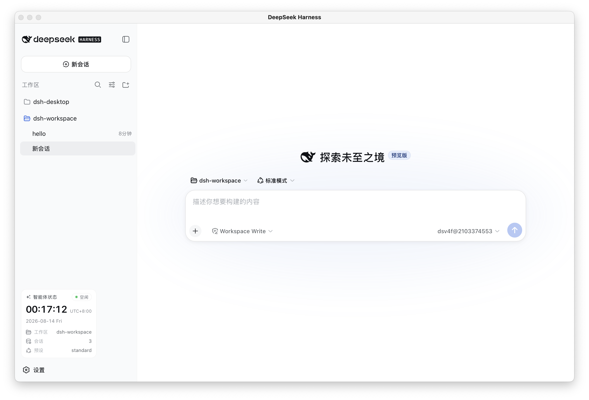

# dsh-desktop

> 🖥️ Native macOS desktop client for the [DeepSeek Harness](https://www.npmjs.com/package/@deepseek-ai/dsh) Web GUI.

<p align="center">
  
</p>

<p align="center">
  <a href="LICENSE"></a>
  <a href="#"></a>
  <a href="#"></a>
  <a href="https://github.com/xiaoq17/dsh-desktop/actions"></a>
  <a href="https://github.com/xiaoq17/dsh-desktop/releases"></a>
</p>

> **Disclaimer:** This is an **unofficial, community** desktop client. It is not
> affiliated with or endorsed by DeepSeek. "DeepSeek Harness" and its logo
> belong to their respective owners.

**Fully self-contained** — bundles its own Node runtime and the entire
`@deepseek-ai/dsh` backend, so there is nothing to install, configure, or start
separately. Built with **Swift + WKWebView** (no Electron), native look and
feel.

## What "self-contained" means

| Item | Source |
|---|---|
| Node runtime | bundled (`Contents/Resources/runtime/bin/node`) |
| dsh backend + deps | bundled (`Contents/Resources/dsh/node_modules`) |
| Server | started by the app on launch, on a **free random port** (`--port 0`) |
| Dependencies | **none** — no system Node, no `dsh` CLI, no npx cache |

The app detects the backend URL from the server's own output and loads it in a
WKWebView. It does **not** depend on any external `dsh web` service or a fixed
port like 3080 — shut down whatever else is running and the app keeps working
on its own.

The backend boots its own **`desktop` profile** (`dsh --profile desktop`): a
desktop-owned Cordis patch layer under `~/.dsh/profiles/desktop` (seeded from
the bundle on first launch), so desktop-specific plugin/config iteration never
touches the upstream `web` profile or the `@deepseek-ai/dsh-web-app` plugin.

## Features

- 🖥 Native macOS window
- ⚡ **Embedded backend**: launch → server starts → GUI loads, all automatic
- 🔀 Uses a **random free port** — never conflicts with other local servers
- 🔍 **Heartbeat monitor**: if the embedded server dies, the app shows a
  recovery view with **Restart Server**; when it comes back it auto-reloads
- 🧭 Menus: Reload (⌘R), Open in Browser (⌘B), Server → Restart/Stop/Status
- 🔗 External links open in your default browser
- 💾 Remembers window size & position
- 🔒 Server lifecycle bound to the app: quit the app, the server stops (no orphans)
- 🔄 **Auto-update**: in-place updates via GitHub Releases, checksum-verified
  (see [Auto-update](#auto-update))
- 📜 Logs: `~/Library/Logs/dsh-desktop-app.log`, `~/Library/Logs/dsh-desktop-server.log`
- 🧩 Reuses your existing `~/.dsh` profile/settings/sessions (honours `DSH_HOME`)
- 🌐 **Web search works out of the box**: the model-side `web_search` tool is
  backed by a built-in [Volcano Ark](https://www.volcengine.com/docs/82379/1756990)
  provider (`volcano-ark`) that reuses your existing Volcano API key — no
  `DEEPSEEK_API_KEY` needed (see [Desktop web search](#desktop-web-search))

## Install

### Option A — DMG (drag & drop)

Download the latest `.dmg` from the
[Releases page](https://github.com/xiaoq17/dsh-desktop/releases), open it and
drag **dsh-desktop** onto the **Applications** shortcut.

### Option B — install script

```bash
git clone https://github.com/xiaoq17/dsh-desktop.git
cd dsh-desktop
./scripts/install.sh          # build → /Applications → launch
./scripts/install.sh --dmg    # install from a pre-built .dmg
```

## Usage

Launch **dsh-desktop**. The app starts its embedded server, waits for it,
and loads the GUI — nothing else required. The first launch may take a few
seconds while the bundled backend boots.

## Auto-update

The app can update itself in place (no manual re-download needed), and **never
interrupts what you're doing**:

- On launch it **silently checks** for a newer version (at most once per 24h,
  and it honours **Skip This Version**).
- **dsh-desktop ▸ Check for Updates…** checks on demand.
- When an update is found, the app **downloads and verifies it in the
  background**, then only *stages* it: the **dsh-desktop ▸ Restart to Install
  dsh-desktop …** menu item lights up and the Dock icon bounces once. Nothing
  restarts until **you** click that item — the app then hands off to the
  embedded `dsh-updater` helper (the `relaunch_helper` pattern) which swaps the
  bundle and relaunches the new version. A staged update persists across
  restarts until you apply it.

### Publishing a release

The app polls
`https://github.com/xiaoq17/dsh-desktop/releases/latest/download/update-manifest.json`,
so every release must attach a file named exactly `update-manifest.json` plus
the versioned `.dmg`.

```bash
# 1. Dry run — build + package + emit manifest
./scripts/publish-update.sh

# 2. Publish — create a GitHub release + upload DMG & manifest
DSH_RELEASE_NOTES="• What's new in 0.1.0.0" ./scripts/publish-update.sh --release
```

Requires the [`gh` CLI](https://cli.github.com/) (authed) or a `GITHUB_TOKEN`.
The desktop version is derived automatically from the embedded dsh version —
bump the desktop revision with `DSH_DESKTOP_REV` (see
[Version scheme](#size--notes)), then `./scripts/publish-update.sh --release`.

### Local-development updates

Rebuilding while the app is running follows the **same** stage → remind → apply
flow as a GitHub release, no publishing needed:

```bash
DSH_DESKTOP_REV=1 ./scripts/dev-update.sh   # build + DMG + file:// manifest
                                            # (auto-points the running app at it)
```

The script **automatically writes the `DSHUpdateManifestURL` override** (a
`file://` URL pointing at `dist/dev-update.json`) for the running bundle, so
there's no manual `defaults write` step.

Then trigger **Check for Updates…** (or wait for the silent check): the fresh
build is staged in the background, the **Restart to Install …** item lights up,
and clicking it swaps to the new build. Bump `DSH_DESKTOP_REV` each iteration —
an identical version number is still treated as an update when the git `build`
rev differs (spec S-0001 §7.2).

After a local `file://` update is applied, the app **automatically clears the
`DSHUpdateManifestURL` override** and reverts to the default (GitHub) manifest
URL on the next check (spec S-0001 FR-9.11) — no manual cleanup needed.

### Configuration

| Knob | How to set |
|---|---|
| Manifest URL (build-time) | `DSH_UPDATE_MANIFEST_URL="https://…" ./scripts/build.sh` (default: this repo's `releases/latest`) |
| Manifest URL (per machine) | `defaults write com.deepseek.dsh.desktop DSHUpdateManifestURL "https://…"` (`file://…` for local dev) |
| GitHub repo (publish) | `DSH_GITHUB_REPO="owner/repo" ./scripts/publish-update.sh --release` |
| Release notes | `DSH_RELEASE_NOTES="…" ./scripts/publish-update.sh --release` |

> Note: release builds are **ad-hoc signed**, so a freshly downloaded copy
> carries the `com.apple.quarantine` attribute; the updater strips it so
> Gatekeeper won't block the relaunch. For public distribution, sign with a
> Developer ID and notarize.

## Desktop web search

The desktop profile ships a built-in search provider that lets the agent's
`web_search` tool run on a **Volcano Ark** (火山方舟) API key instead of
`DEEPSEEK_API_KEY` (spec [S-0002](docs/specs/0002-web-search-via-volcano-api.md),
plugin `plugins/volcano-search`).

- **How it works**: the provider calls Ark's Responses API
  (`POST https://ark.cn-beijing.volces.com/api/v3/responses`) declaring the
  `web_search` tool; the model decides the keywords and returns a synthesized
  answer with cited `url_citation` sources.
- **Key resolution** (first match wins): literal `apiKey` config → env
  `ARK_API_KEY` → your credentials service entry under the search-dedicated ref
  (default `WEB_SEARCH_ARK_API_KEY`, isolated from the model key) →
  `$DSH_HOME/config/volcano.json` → `WEB_PROVIDER_CREDENTIAL_MISSING`.
- **Activation**: the Ark **联网内容插件** (Web Search plugin) must be enabled
  for your account once — see
  `https://console.volcengine.com/common-buy/CC_content_plugin`. Until then the
  tool returns a clear `WEB_PROVIDER_NOT_OPEN` hint.
- **Config**: override model/endpoint/limits through the profile's
  `cordis.patch.yml` (`web-search-volcano` row) or env (`ARK_MODEL`,
  `ARK_BASE_URL`).

## Development

> **Change gate：Agent Notes**——任何非平凡代码修改在同一变更中附带
> [Agent Note](.agents/notes/README.md)（决策记录，双语）；设计/需求走
> [spec](docs/specs/README.md)（`S-NNNN`，中文）。工程规范镜像 harness 家族
> 仓库（[`AGENTS.md`](AGENTS.md)、[`docs/AGENTS.md`](docs/AGENTS.md)、
> [`docs/development.md`](docs/development.md)、[`docs/testing.md`](docs/testing.md)）。
> 安装钩子：`./scripts/install-hooks.sh`。

```bash
pnpm install                # install the plugin workspace (plugins/*)
pnpm run lint               # oxlint
pnpm run typecheck          # strict NodeNext typecheck (plugins + scripts)
pnpm run test               # vitest (source-plane)
pnpm run test:coverage      # per-file 100% coverage gate on plugins/*/src
pnpm run hygiene            # knip + publint + workspace constraints + NodeNext consumer
pnpm run doc-sync           # doc gates (md-links / budgets / jsdoc / typecheck / agent-notes)
./scripts/build.sh          # download Node + install dsh deps + compile plugins + Swift → dist/*.app
./scripts/make-dmg.sh       # package a .dmg
./scripts/install.sh        # install + launch
./scripts/publish-update.sh # build + dmg + update manifest (+ --release to publish)
./scripts/run-tests.sh      # Swift UpdatePolicy + plugin vitest tests
./scripts/smoke-check.sh    # product-level checks on dist/*.app + manifest (full|light)
```

### Project layout

```
app/Sources/               Swift sources (macOS shell)
  AppDelegate.swift          app lifecycle, main menu, @main entry
  MainWindowController.swift WKWebView window, recovery view, heartbeat monitor
  ServerManager.swift        starts the embedded server, parses its port, seeds/syncs the desktop profile
  UpdateManager.swift        auto-update: background check/stage + verify, restart-reminder, apply-on-click
  UpdatePolicy.swift         pure update logic (version compare / skip & pending keys / manifest matching)
  UpdaterHelper.swift        standalone dsh-updater (swaps bundle + relaunches)
plugins/                   desktop Cordis plugins (pnpm workspace, TS → lib)
  volcano-search/            Volcano Ark web_search provider (S-0002)
tests/                     unit tests (UpdatePolicyTests — spec S-0001 §8.6)
scripts/                   repo gates (TS, via tsx) + build/dev/publish/install shell scripts + helpers
  build.sh                  bundles Node + dsh deps, compiles plugins + Swift, assembles .app
  make-dmg.sh               builds the one-click .dmg
  publish-update.sh         builds + emits update manifest (+ GitHub release with --release)
  install.sh                one-click installer
  dev-update.sh             local dev update: build + DMG + file:// manifest
  run-tests.sh              Swift UpdatePolicy + plugin vitest tests
  smoke-check.sh            product-level checks on dist/*.app + manifest (full|light)
  verify-md-links.ts …      doc gates (lint/typecheck/coverage/hygiene/duplication/doc-sync)
.agents/                   Agent Notes (decision records; proposed/implemented/rejected, bilingual)
assets/                    config & static files only
  AppIcon.icns              app icon
  Info.plist                bundle metadata
  desktop-profile/          desktop profile template (config only: package.json / cordis.yml / cordis.patch.yml / pnpm-workspace.yaml)
package.json               pnpm workspace root
pnpm-workspace.yaml        workspace definition (plugins/*, nodeLinker: hoisted)
tsconfig.base.json         shared TS base config (NodeNext, strict)
docs/                      spec docs (specs/README.md convention + NNNN-*.md) + doc standards
                           (AGENTS.md / development.md / testing.md / cookbook/) + screenshot (app.png)
dist/                      output: .app, .dmg and update-manifest.json (gitignored)
```

### Specification

Specs live in [`docs/specs/`](docs/specs/README.md) under the RFC/ADR-style
naming convention (`NNNN-<slug>.md`, one concern per spec, no renumbering).
The initial-version [specification](docs/specs/0001-initial-version.md)
(S-0001) documents the architecture, functional/non-functional requirements,
the update pipeline, build & packaging, data handling, security considerations
and known limitations — the baseline against which future releases are
tracked.

### Size & notes

- The .app is ~460 MB because it embeds the full Node runtime and all dsh
  production dependencies (the price of being fully self-contained).
- Target: macOS 13.0+, Apple Silicon (arm64). Rebuild for x86_64 by changing
  `-target` in `scripts/build.sh` to `x86_64-apple-macos13.0` and the Node tarball URL.
- **Version scheme**: the desktop version is four parts
  (`<dsh major>.<dsh minor>.<dsh patch>.<desktop rev>`). The first three are
  derived from the embedded `@deepseek-ai/dsh` version at build time; the
  fourth is the desktop revision, starting at `0` (`DSH_DESKTOP_REV` to
  override). It resets when dsh is upgraded.

## Contributing

See [CONTRIBUTING.md](CONTRIBUTING.md) for setup, the Agent-Note change gate,
style and the PR checklist, plus the engineering conventions in
[AGENTS.md](AGENTS.md) and [docs/AGENTS.md](docs/AGENTS.md). Please also read
our [Code of Conduct](CODE_OF_CONDUCT.md).

## Security

Found a vulnerability? See [SECURITY.md](SECURITY.md) — report privately, not
via a public issue.

## License

[MIT](LICENSE) © 2026 Qin Xiao.

The bundled `@deepseek-ai/dsh` backend is [MIT-licensed](https://github.com/deepseek-ai/dsh) (© 2026 DeepSeek).
